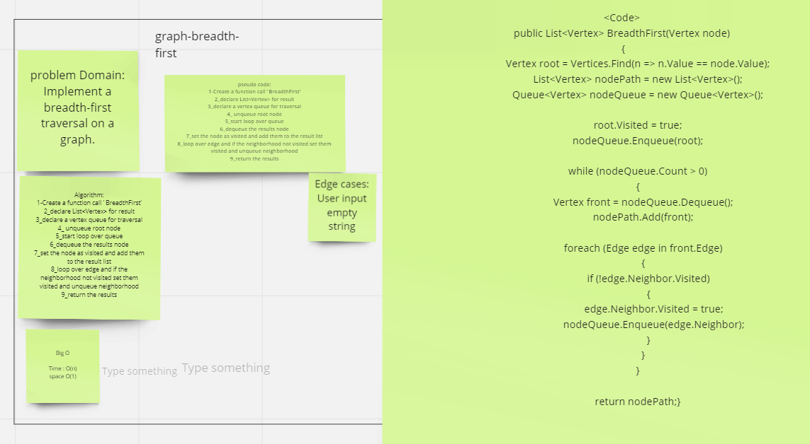

# Challenge Summary
Implement a breadth-first traversal on a graph.

## Whiteboard Process

## Approach & Efficiency
- Big O Space = O(n)
- Big O Time = O(n)

## Solution

Clone this repository to your local machine.
Add Nodes .
Then Use breadth-first traversal fanction  you will get the value.