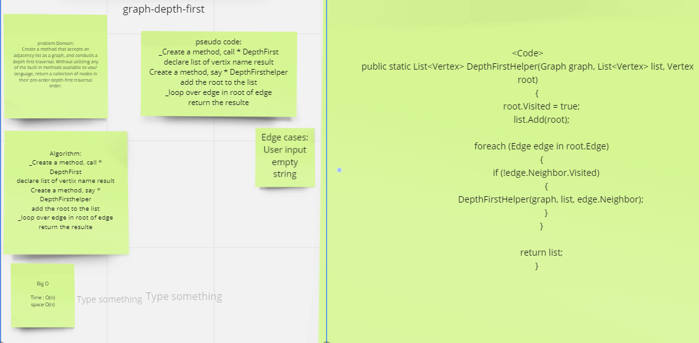

# Depth First Traversal

## Challenge

Conduct a depth first preorder traversal on a graph

## Whiteboard Process

## Approach & Efficiency

Big O for DepthFirstHelper function is O(n)

## Solution

Clone this repository to your local machine.
Add Nodes .
Then Use DepthFirstHelper fanction  you will get the value.