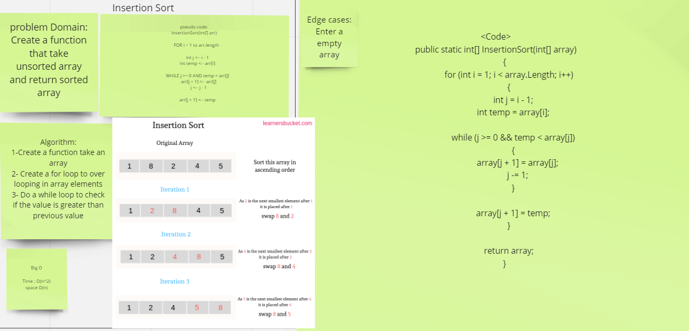

# Challenge Summary

Create a function that take unsorted array and return sorted array

## Whiteboard Process

## Approach & Efficiency

Big O for IsertionSort is O(n^2)

## Solution

Clone this repository to your local machine.
Add unsorted array.
Then Use InsertionSort fanction  you will get the sorted array.