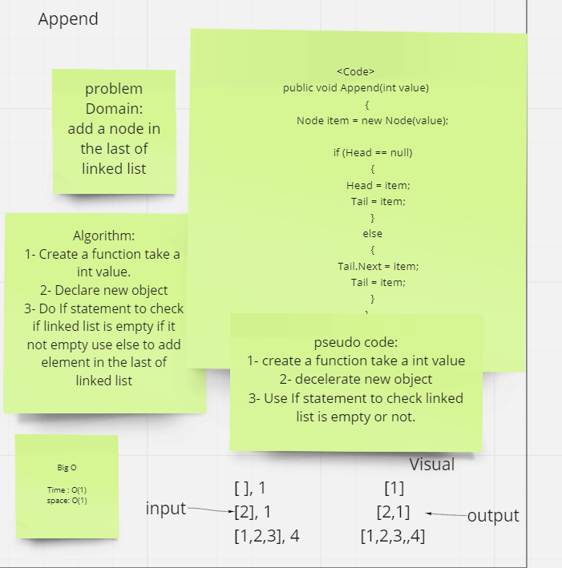

# Singly Linked List

Linked List is a linear data structure made of a sequence of Nodes that are linked to each other. Each Node are linked together by the reference field.

---

## Challenge

Write a method for the Linked List class which takes a number and add it to First linked list or to End of linked lists or search for a value on linked lists and display the results on console or adds a new node with the given new value immediately before the first node that has the value specified and adds a new node with the given new value immediately after the first node that has the value specified .

---

## Approach & Efficiency

Big O for AddFirst is O(1) and space O(1)
-
 Big O for search is O(n) and space O(1) 
-
 Big O for Append is O(1) and space O(1) 
-
 Big O for inserBefore is O(n) and space O(1) 
 -
  Big O for inserAfter is O(n) and space O(1) 
  -

  ---

  ## Visual

  - 

 - 

 - 
 

---

## API

AddFirst : To add node in the first linked lists.

AddLast : To add node in the last linked lists.

search : To search for a specific value in linked lists.

AddBefore : To add a new node with the given new value immediately before the first node that has the value specified.

AddAfter : To add a new node with the given new value immediately after the first node that has the value specified
