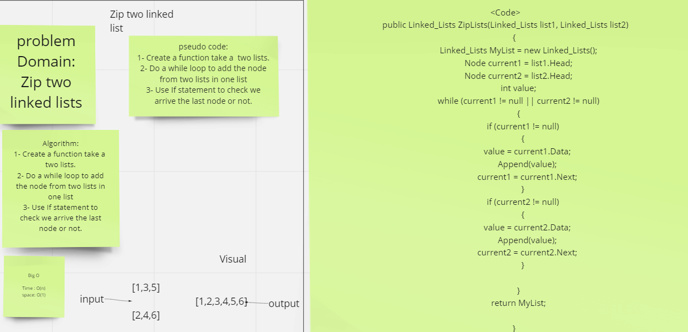

# Ziplist

## Challenge

 method for the Linked List class which accepts two linked lists. Return a single linked list where the values have been merged in alternating order, like a zipper.​

 ## Approach & Efficiency

 Big O for Ziplist is O(n) and space O(1)

 ## Visual

 