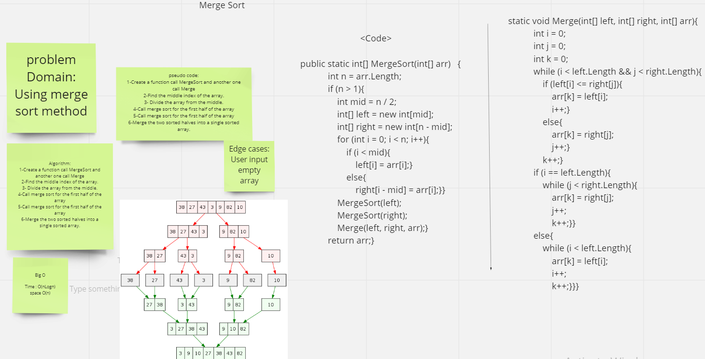

# Challenge Summary

Input random array and reshape it by merge sort method

## Whiteboard Process

## Approach & Efficiency

Big O for MergeSore is O(nlogn)

## Solution

Clone this repository to your local machine.
Add unsorted array.
Then Use MergeSort fanction  you will get the sorted array.