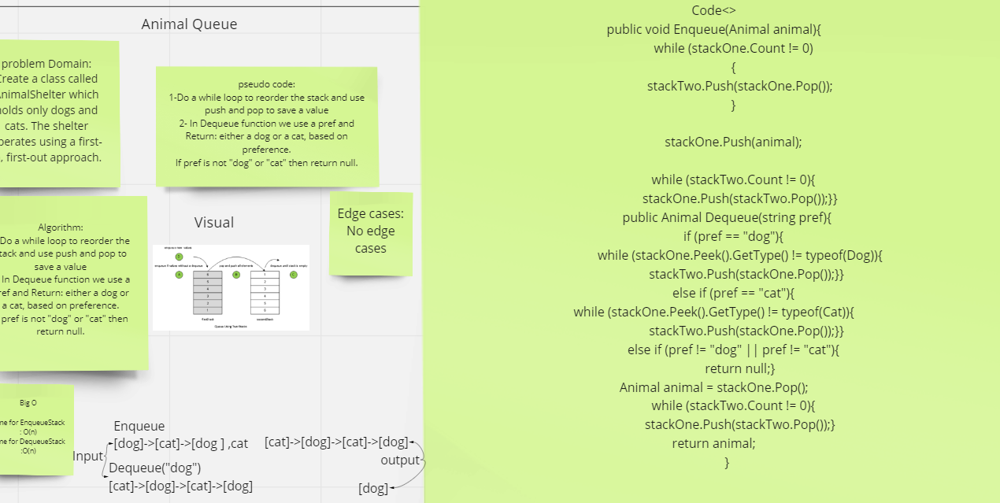

# Challenge Summary
First-in, First out Animal Shelter

---

## Whiteboard Process

---

## Approach & Efficiency

Big O for Enqueue O(n)

Big O for Dequeue O(n)

---

## Solution

Clone this repository to your local machine.
Add some value by use EnqueueStack.
Then Use DequeueStack you will get the first value you enter it.

