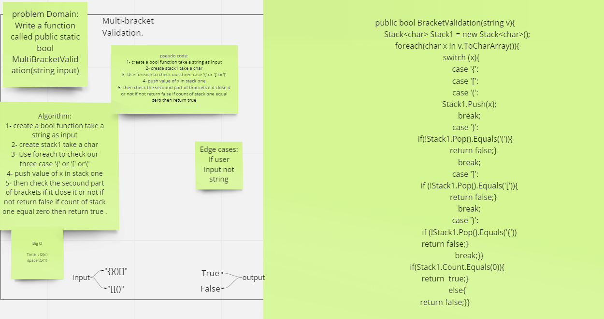

# Challenge Summary

Write a function called public static bool MultiBracketValidation(string input). This function should take a string as its only argument, and should return a boolean representing whether or not the brackets in the string are balanced. There are 3 types of brackets:

- Round Brackets : ()
- Square Brackets : []
- Curly Brackets : {}

## Whiteboard Process

## Approach & Efficiency

Big O for Brackets O(n)

## Solution

Clone this repository to your local machine.
Add some value by use EnqueueStack.
Then Use DequeueStack you will get the first value you enter it.
