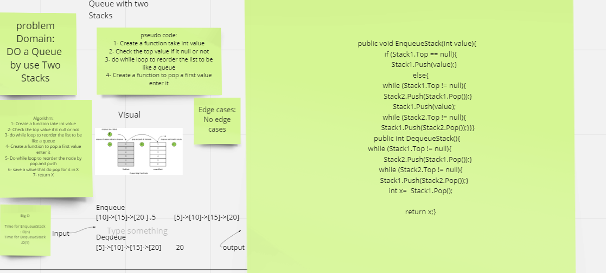

# PesudoQueue

## Challenge:

Make Queue by use Two stacks

## Approach & Efficiency

Big O for EnqueueStack O(n)
Big O for DequeueStack O(n)

## Whiteboard Process

## Soultion
Clone this repository to your local machine.
Add some value by use EnqueueStack.
Then Use DequeueStack you will get the first value you enter it.

